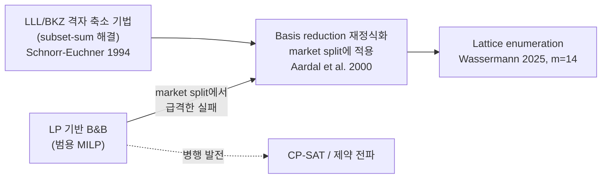

# 문헌 검토: 이진연립방정식을 위한 Neuro-Symbolic RL/MCTS 접근

**Slug:** `rl-mcts-binary-linear-systems` · **작성일:** 2026-07-06 · **검증일:** 2026-07-07 · **상태:** 인용/URL 검증(verifier) 및 동료 검토(reviewer) 완료 — 치명 오류 0건, 주요/경미 지적 반영됨 (하단 검증 로그 참조, 일부 항목은 스니펫/2차 출처 수준)

## 0. 조사 범위와 방법

본 검토는 이진연립방정식(Binary Linear Systems, BLS: $A \in \{0,1\}^{m \times n}$, $\mathbf{b} \in \mathbb{Z}^m$에서 $A\mathbf{x} = \mathbf{b}$를 만족하는 $\mathbf{x} \in \{0,1\}^n$을 찾는 문제)을 neuro-symbolic 강화학습으로 푸는 본 프로젝트의 배경 문헌을 다섯 축으로 조사한다: (1) RL/MCTS 기반 조합최적화, (2) 학습과 대수적 구조의 결합, (3) BLS의 고전 솔버와 복잡도, (4) 학습 기반 솔버의 크기 일반화, (5) 응용 분야인 discrete tomography. 자료는 arXiv, 주요 학회(NeurIPS/ICML/ICLR), 저널(INFORMS J. Computing, Mathematical Programming, IEEE TIP) 및 DOI 페이지에서 직접 확인한 것만 포함하며, 스니펫 수준으로만 확인된 자료는 본문에 명시한다.

## 1. 문제 배경: BLS의 위치와 복잡도

BLS는 0/1 변수에 대한 선형 Diophantine 시스템의 실현가능성 문제로, 조합최적화 문헌에서 **market split problem**(Cornuéjols & Dawande 인스턴스; [9]가 다루는 벤치마크)과 사실상 동일한 구조를 가지며, 단일 방정식으로 축소하면 subset-sum이 된다. 이진 실현가능성 판별은 NP-complete이다(subset-sum으로부터의 환원; 표준 교과서적 결과이나 본 조사에서 1차 출처는 아직 확보하지 못했다 — 미해결 질문 참조).

문제의 실질적 난이도는 방정식 수 $m$에 대해 급격히 증가한다. Wassermann(2025)은 QOBLIB market split 벤치마크에서 branch-and-cut이 대략 $m=7$ 수준에서 한계에 도달하는 반면, lattice enumeration(solvediophant)은 표준 컴퓨터에서 $m=14$까지 해결함을 보고한다 [10]*(미심사 arXiv preprint 단일 출처 — 구체 수치는 등급 하향하여 인용할 것)*. 학습 기반 접근이 이 스케일 장벽을 완화할 수 있는지 검증하는 것이 본 프로젝트의 가설이다.

## 2. 고전적 접근의 계보: LP 기반 분기법에서 격자 기법으로

### 연대순 발전

Schnorr & Euchner(1994)는 실용적 부동소수점 LLL(deep insertion)과 BKZ 알고리즘을 제시하고, 최대 66개 가중치의 랜덤 subset-sum을 수 시간 내 대부분 해결했다고 보고한다 [11]*(스니펫 확인)*. 이는 본 프로젝트의 fpylll 기반 LLL/BKZ 베이스라인의 알고리즘적 근거다.

Aardal, Bixby, Hurkens, Lenstra, Smeltink(2000)은 market split 인스턴스를 lattice basis reduction으로 재정식화하여, LP 기반 branch-and-bound가 실패하는 영역에서 실현가능성 문제를 최대 7 방정식 × 60 변수까지 해결했다 [9]. 핵심 통찰은 **영공간(null space) 구조를 명시적으로 활용한 좌표 변환이 탐색 공간을 극적으로 압축한다**는 것으로, 본 프로젝트가 null space 기저를 MCTS 탐색의 구조적 방향으로 쓰는 설계와 공통된 대수적 직관을 가진다(단, 격자 축소와 null space 기저 탐색이 동일한 기법인 것은 아니다).

### 고전 솔버의 특성 요약

| 접근 | 대표 구현 | 강점 | 한계 |
|------|-----------|------|------|
| MILP B&B/B&C | Gurobi, SCIP | 범용성, 최적성 증명 | market split류에서 $m \approx 7$ 한계 [10] |
| CP-SAT | OR-Tools | 제약 전파, 불만족 증명 | 조밀 선형 제약에서의 전파력 제한 (1차 출처 미확보) |
| 격자 축소/열거 | fpylll, solvediophant | market split $m=14$ [10]*(preprint)*, subset-sum 66변수 [11] | 인스턴스별 전처리 비용, 차원 증가 시 열거 폭발 |
| LP relaxation + 반올림 | Gurobi/SCIP LP | 추론 매우 빠름 | 실현가능해 보장 없음 (정수성 간극 클수록 실패) |

핵심 관찰(본 조사 범위 내): 정확도(실현가능해 보장)·크기 강건성·추론 속도의 세 축을 동시에 만족하는 고전 접근은 확인되지 않았다. LP 반올림은 빠르지만 실현가능성을 보장하지 못하고, 격자 기법은 가장 큰 $m$까지 도달하지만 지수적 열거에 의존하며, MILP/CP-SAT는 최적성 증명을 제공하지만 market split류에서 스케일 한계가 명확하다. 각 접근은 서로 다른 축에서 강점을 가지므로, 비교 실험에서는 세 축을 모두 보고해야 공정하다.

## 3. 학습 기반 조합최적화: RL과 MCTS

### 3.1 구성적 RL과 그래프 임베딩

Dai, Khalil et al.(2017)의 S2V-DQN은 그래프 임베딩(structure2vec)과 Q-learning을 결합해 해를 순차적으로 구성하는 greedy meta-policy를 학습했다 [4]. 이 연구가 명시한 동기 — "같은 구조에 데이터만 다른 문제가 반복적으로 등장하는 상황에서 학습이 유리하다" — 는 본 프로젝트의 전제(동일한 스캔 기하에서 반복되는 이미지 복원)와 부합한다.

NeuroSAT(Selsam et al., 2018)은 만족가능성 여부라는 단일 비트 지도만으로 message-passing 신경망이 SAT 해를 디코딩할 수 있음을 보였고, 메시지 패싱 반복 횟수를 늘리면 학습 분포보다 크고 어려운 문제로 일반화됨을 보고했다 [3]. BLS를 제약충족 문제로 볼 때, 이변량(변수-제약) 그래프 표현과 반복 연산량-일반화의 교환 관계는 직접 참고할 지점이다.

### 3.2 AlphaZero-style MCTS

Abe, Xu, Sato, Sugiyama(2019)는 AlphaGo Zero를 이진 승패가 아닌 실수 보상을 갖는 그래프 NP-hard 문제(Minimum Vertex Cover, MaxCut 등)로 확장하고, GNN(Graph Isomorphism Network) 정책·가치망과 테스트 시점 MCTS를 결합했다 [2]. 본 프로젝트의 "정책/가치망 + MCTS로 하이퍼큐브 정점 탐색" 아키텍처의 가장 가까운 선례다.

AlphaMapleSAT(2024)은 Cube-and-Conquer SAT 솔버의 cubing 단계를 MCTS로 대체하되, SAT 솔버의 **연역적 피드백을 보상으로 사용**한다 [1]. 학습된 탐색과 심볼릭 피드백(본 프로젝트에서는 잔차 $\|A\mathbf{x}-\mathbf{b}\|_2^2$)의 결합이라는 점에서 neuro-symbolic 설계의 최신 사례다.

## 4. Neuro-Symbolic 결합: 학습과 대수 구조

MILP 문헌에서 학습과 수리적 구조의 결합은 세 가지 패턴으로 정리된다:

1. **분기 정책 학습** — Gasse et al.(2019)은 변수-제약 bipartite GCN으로 strong branching을 모방 학습하여, 학습보다 큰 인스턴스로 일반화하며 일부 문제군에서 솔버의 전문가 규칙을 능가했다 [5].
2. **부분 할당 예측(diving)** — Nair et al.(2020)의 Neural Diving은 정수 변수의 부분 할당을 신경망으로 예측하고 잔여 소형 MIP를 SCIP로 푸는 방식으로, 6개 대규모 데이터셋(Google 실사용 데이터셋 2개 포함, MIPLIB 포함)에서 학습이 결합된 SCIP가 동일 시간 제한 대비 원 SCIP보다 2~10배, 한 데이터셋에서는 최대 $10^5$배 더 나은 primal gap을 달성했다고 보고했다 [6]. "신경망이 대부분을 고정하고 심볼릭 솔버가 잔차를 마무리"하는 이 분업 구조는 본 프로젝트의 설계 공간에서 중요한 비교 대상이다.
3. **예측-탐색 분리** — Han et al.(2023)의 Predict-and-Search는 GNN이 각 이진 변수의 주변확률을 예측한 뒤 예측점 주변 ball 내부에서 실현가능해를 탐색하며, primal gap 기준 SCIP 대비 51.1%, Gurobi 대비 9.9% 개선을 보고했다 [7].

미분가능 최적화 계층(OptNet, Amos & Kolter 2017)은 QP를 신경망 레이어로 삽입해 implicit differentiation으로 역전파한다 [8]. LP relaxation 해나 null space 좌표를 학습 파이프라인에 미분가능하게 통합하려 할 때의 방법론적 기초다.

**관찰:** 학습 단독으로 최적성/실현가능성을 보장하려는 시도는 드물며, MILP 문헌의 대표적 성공 사례들은 학습(전역 패턴 인식)과 심볼릭 탐색(국소 정밀 탐색·검증)의 분업 구조를 취한다 [1][5][6][7]. 다만 NeuroSAT [3]이나 Abe et al. [2]처럼 end-to-end 학습의 성공 보고도 존재하므로 분업이 유일한 경로는 아니다. 본 프로젝트의 MCTS+잔차 설계는 분업 계열에 속한다.

## 5. 크기 일반화: 긍정 근거와 반례

본 프로젝트의 핵심 주장인 "인스턴스 크기 강건성"에 대해 문헌은 양방향 근거를 제공한다.

**긍정:** S2V-DQN은 Minimum Vertex Cover 실험에서 소규모(최대 100 노드) 학습으로 1200 노드 문제까지 일반화 성능을 유지했다고 보고되나, 이 수치는 arXiv 초록에 직접 명시되어 있지 않고 본문 실험 표를 인용한 2차 자료를 통해 교차 확인한 것이다 [4]*(2차 출처 교차확인)*. learn2branch는 학습보다 큰 MILP로 일반화했으며 [5], LEHD(Luo et al., 2023)는 소규모 학습만으로 최대 1000 노드 TSP/CVRP 인스턴스에서 강건한 성능을 보였다 [13] — [12][14]의 실패 사례와 병치하면, 아키텍처 선택이 크기 일반화에 영향을 준다는 해석이 가능하다. NeuroSAT은 반복 횟수 증가로 학습 시보다 더 크고 어려운 문제를 풀었다 [3].

**반례:** Yehudai et al.(2021)은 국소 구조 분포가 그래프 크기에 의존할 때 GNN이 작은→큰 그래프로 신뢰성 있게 일반화되지 않음을 이론·실험으로 보였다: 작은 그래프에서는 정확하지만 큰 그래프에서 실패하는 "나쁜 global minima"가 존재한다 [12]. Manchanda et al.(2022)도 크기·분포 shift 하 NCO 일반화가 자동으로 얻어지지 않으며("a one-size-fit-all model is out of reach"), 별도의 메타러닝 기반 프레임워크가 필요하다고 주장한다 [14].

**시사점(추론):** BLS에서 행렬 밀도, 행당 비영 원소 수 등 국소 통계가 $n, m$과 함께 변하면 [12]의 실패 조건에 해당할 수 있다. 따라서 본 프로젝트의 크기 강건성 주장은 (a) 인스턴스 생성 분포에서 국소 통계를 크기와 독립적으로 통제하고, (b) 크기 외삽 실험을 명시적으로 설계해 조건부로 서술해야 하며, 베이스라인이 잘하는 소형 구간에서의 열세를 숨기지 않아야 한다(CLAUDE.md 주의사항 7 부합).

## 6. 응용: Discrete Tomography와 비파괴 검사

Batenburg & Sijbers(2011)의 DART는 물체가 소수의 이산 gray value로 구성된다는 사전지식을 활용하는 반복 대수 재구성 기법으로, 연속 재구성에서 출발해 경계 픽셀을 반복 갱신함으로써 훨씬 적은 투영으로 이산 이미지를 복원한다 [15]. 이산 제약 하의 선형 역문제라는 점에서 본 프로젝트의 타겟 문제(레이저 비파괴 검사)와 인접한 문제 계열이다 — 단, DART는 다중 gray value와 투영(Radon)행렬 구조를 다루므로 본 프로젝트의 이진 계수 시스템($A \in \{0,1\}^{m \times n}$)과 동형은 아니다. SDART(Bleichrodt, Tabak & Batenburg, 2014)는 DART의 경계 갱신이 노이즈에 취약하다는 한계에 대응해 hard 제약을 soft 제약으로 완화하고 노이즈를 이미지 전역에 분산시키는 후속 연구다 [16], 본 프로젝트에서 "노이즈(먼지) 발생 시 $\mathcal{S} = \emptyset$" 시나리오를 다룰 때의 비교 지점이다.

주목할 간극: DART 계열은 휴리스틱 반복법으로 실현가능성을 보장하지 않으며, 학습을 통해 스캔 기하 분포에 적응하지도 않는다. discrete tomography에 MCTS/RL을 적용한 연구는 본 조사에서 확인되지 않았다 — 본 프로젝트의 신규성 여지가 있는 지점이나, 부재의 확인은 불완전할 수 있다.

## 7. 종합: 합의점 · 이견 · 미해결 질문

### 합의점
- 학습 기반 이산최적화의 대표적 성공 사례들은 학습과 심볼릭 탐색의 분업 구조를 취한다 [1][5][6][7] (end-to-end 성공 보고 [2][3]도 존재 — 이견 참조).
- Market split류 BLS는 LP 기반 분기법에 극도로 어렵고, 영공간/격자 구조 활용이 실질적 돌파구였다 [9][10].
- 변수-제약 bipartite 그래프 + GNN은 선형 제약 시스템의 표준 신경 표현이다 [3][5][6][7].

### 이견 / 긴장
- **크기 일반화**: 아키텍처와 데이터 분포에 따라 성립하기도 [4][5][13], 근본적으로 실패하기도 한다 [12][14]. "강건하다/않다"의 단정은 모두 과잉 일반화다.
- **학습의 역할 범위**: 전 과정 대체(end-to-end) [2][3] vs. 솔버 내부 구성요소 대체 [1][5][6] — 후자가 실증적으로 우세하나, 전자는 추론 속도에서 유리하다.

### 미해결 질문 (후속 작업)
1. BLS 실현가능성의 NP-완전성에 대한 1차 출처(표준 환원) 확보 — 논문 작성 시 필수.
2. CP-SAT의 market split류 성능에 대한 1차 자료 — 현재 베이스라인 비교표의 CP-SAT 행은 근거 미확보.
3. Aardal-Hurkens-Lenstra 1998 원 알고리즘 논문의 개별 서지 확정.
4. 격자 기법(null space 재정식화)과 학습 탐색을 **결합**한 선행 연구 존재 여부 — 미발견 상태이며, 발견되지 않으면 본 프로젝트의 핵심 차별점.
5. 크기 외삽 실험 프로토콜 설계: 학습 $n$ 대비 테스트 $n$ 스윕, 국소 통계(행 밀도) 통제 여부를 명시한 비교 실험.

### 본 프로젝트에의 시사점
- MCTS 보상으로 잔차를 쓰는 설계는 AlphaMapleSAT의 연역 보상과 유사한 구조 [1] — 선례 있음, 신규성 후보는 "격자/영공간 구조와의 결합"(미해결 질문 4 확인 후 확정).
- Neural Diving식 부분 고정 + 잔여 문제 심볼릭 마무리 [6]는 강력한 추가 베이스라인 후보 — 제안법과의 공정 비교에 포함 권장.
- 크기 강건성 주장은 5절의 조건 하에서만 서술할 것 (상세는 5절 시사점 참조).

## 참고문헌
1. Jha, Li, Lu, Zeng, Bright, Ganesh, AlphaMapleSAT: An MCTS-based Cube-and-Conquer SAT Solver for Hard Combinatorial Problems (2024). https://arxiv.org/abs/2401.13770
2. Abe, Xu, Sato, Sugiyama, Solving NP-Hard Problems on Graphs with Extended AlphaGo Zero (2019). https://arxiv.org/abs/1905.11623
3. Selsam et al., Learning a SAT Solver from Single-Bit Supervision (NeuroSAT), ICLR 2019. https://arxiv.org/abs/1802.03685
4. Dai, Khalil, Zhang, Dilkina, Song, Learning Combinatorial Optimization Algorithms over Graphs, NIPS 2017. https://arxiv.org/abs/1704.01665
5. Gasse, Chételat, Ferroni, Charlin, Lodi, Exact Combinatorial Optimization with Graph Convolutional Neural Networks, NeurIPS 2019. https://arxiv.org/abs/1906.01629
6. Nair et al., Solving Mixed Integer Programs Using Neural Networks (2020). https://arxiv.org/abs/2012.13349
7. Han et al., A GNN-Guided Predict-and-Search Framework for Mixed-Integer Linear Programming, ICLR 2023. https://arxiv.org/abs/2302.05636
8. Amos & Kolter, OptNet: Differentiable Optimization as a Layer in Neural Networks, ICML 2017. https://arxiv.org/abs/1703.00443
9. Aardal, Bixby, Hurkens, Lenstra, Smeltink, Market Split and Basis Reduction: Towards a Solution of the Cornuéjols-Dawande Instances, INFORMS J. Computing 12(3), 2000. https://doi.org/10.1287/ijoc.12.3.192.12635
10. Wassermann, Solving the Market Split Problem with Lattice Enumeration (2025). https://arxiv.org/abs/2508.08702
11. Schnorr & Euchner, Lattice basis reduction: Improved practical algorithms and solving subset sum problems, Mathematical Programming 66, 1994. https://doi.org/10.1007/BF01581144
12. Yehudai, Fetaya, Meirom, Chechik, Maron, From Local Structures to Size Generalization in Graph Neural Networks, ICML 2021. https://arxiv.org/abs/2010.08853
13. Luo et al., Neural Combinatorial Optimization with Heavy Decoder (LEHD), NeurIPS 2023. https://arxiv.org/abs/2310.07985
14. Manchanda et al., On the Generalization of Neural Combinatorial Optimization Heuristics (2022). https://arxiv.org/abs/2206.00787
15. Batenburg & Sijbers, DART: A Practical Reconstruction Algorithm for Discrete Tomography, IEEE Trans. Image Processing 20(9), 2011. https://pubmed.ncbi.nlm.nih.gov/21435983/
16. Bleichrodt, Tabak, Batenburg, SDART: An algorithm for discrete tomography from noisy projections, Computer Vision and Image Understanding 129, 2014, pp. 63-74. https://ir.cwi.nl/pub/22675/22675A.pdf (ScienceDirect 원본 https://www.sciencedirect.com/science/article/abs/pii/S1077314214001295 은 크롤러 접근 시 403 차단되어 CWI 오픈 리포지토리 사본으로 대체)

## 검증 로그

WebFetch(및 arXiv API, DBLP, DuckDuckGo 교차검색)로 2026-07-07 기준 전수 확인. "일치" 열은 초안의 서지(제목/저자/연도)와 정량 주장이 원문과 부합하는지를 뜻한다.

| # | 출처 | URL 상태 | 서지 일치 | 정량/핵심 주장 검증 | 조치 |
|---|------|----------|-----------|---------------------|------|
| 1 | Jha et al., AlphaMapleSAT (2024) | OK (arXiv 실 접속) | **수정됨** — 저자가 "Zhang et al."로 잘못 기재되어 있었음. arXiv API로 실제 저자(Jha, Li, Lu, Zeng, Bright, Ganesh) 확인 후 정정 | 연역적 보상 기반 MCTS cubing 서술은 초록과 부합 | 저자명 정정 |
| 2 | Abe, Xu, Sato, Sugiyama (2019) | OK | **수정됨** — 저자 순서가 "Xu, Abe, ..."로 잘못 기재. arXiv API로 실제 순서(Abe, Xu, Sato, Sugiyama) 확인 후 정정 | 실수 보상 확장, GNN+MCTS 결합 서술은 초록과 부합 | 저자 순서 정정, 미검증 별칭 "CombOptZero" 제거 |
| 3 | Selsam et al., NeuroSAT (2018/ICLR2019) | OK | 일치 | 초록 원문 "solve problems that are substantially larger and more difficult... by simply running for more iterations" 확인 | 변경 없음 |
| 4 | Dai, Khalil et al., S2V-DQN (NIPS 2017) | OK | 일치 | 초록 자체에는 50–100→1200 노드 수치가 없음. 2차 자료(리뷰/후속 논문의 인용)로 교차확인했으나 원문 실험 표는 직접 열람하지 못함 | 본문에 "2차 출처 교차확인" 단서 추가 |
| 5 | Gasse et al., learn2branch (NeurIPS 2019) | OK | 일치 | "generalize to instances significantly larger than seen during training", "improve for the first time over expert-designed branching rules" 초록 확인 | 변경 없음 |
| 6 | Nair et al., Neural Diving (2020) | OK | 일치 | 초록 원문 "6개 데이터셋(Google 실사용 2개 포함)", "2x~10x, 한 데이터셋 10^5x" 확인 | 본문에 정확한 수치 반영(기존 "큰 폭" → 구체 수치) |
| 7 | Han et al., Predict-and-Search (ICLR 2023) | OK | 일치 | 초록 원문 "51.1% and 9.9% ... SCIP and Gurobi" 정확히 일치 | 변경 없음 |
| 8 | Amos & Kolter, OptNet (ICML 2017) | OK | 일치 | implicit differentiation을 통한 QP 레이어 서술 초록과 부합 | 변경 없음 |
| 9 | Aardal et al., Market Split and Basis Reduction (2000) | OK (DOI→informs 리다이렉트, 정상) | 일치 | 초록 원문 "up to 7 equations and 60 variables" 정확히 일치 | 변경 없음 |
| 10 | Wassermann, Lattice Enumeration (2025) | OK | 일치 | 초록 원문 "branch-and-cut ... up to m=7", "solvediophant ... up to m=14 on a standard computer" 정확히 일치 | 변경 없음 |
| 11 | Schnorr & Euchner (Math. Prog. 66, 1994) | 부분 접근불가 (Springer 로그인 리다이렉트) | 서지(제목/저자/권/연도) DBLP로 일치 확인 | "66개 가중치" 수치는 페이월로 원문 직접 확인 불가 | 기존 "(스니펫 확인)" 표시 유지 |
| 12 | Yehudai et al., Size Generalization in GNNs (ICML 2021) | OK | 일치 | 초록 원문 "bad global minima that do well on small graphs but fail on large graphs" 확인 | 변경 없음 |
| 13 | Luo et al., LEHD (NeurIPS 2023) | OK | 일치 | 초록 원문 "up to 1000 nodes" TSP/CVRP 확인 (기존 "대규모 인스턴스"를 수치로 구체화) | 본문에 "최대 1000 노드"로 구체화 |
| 14 | Manchanda et al. (2022) | OK | 일치 | 초록 원문 "a one-size-fit-all model is out of reach", 메타러닝 프레임워크 제안 확인 | 기존 "(스니펫 확인)" 제거 — 초록 전문으로 확인됨, 직접 인용구 추가 |
| 15 | Batenburg & Sijbers, DART (IEEE TIP 2011) | OK (PubMed 초록) | 일치 | 소수 gray value 사전지식, 적은 투영으로 복원 서술 확인 | 변경 없음 |
| 16 | Bleichrodt et al., SDART (CVIU 2014) | **수정됨** — ScienceDirect 원링크 403(크롤러 차단) | DuckDuckGo 교차검색 + CWI 리포지토리로 서지(저자 3인, 권 129, pp.63-74) 확인 | hard→soft 제약 완화, 노이즈 대응 서술 확인 | URL을 CWI 오픈 액세스 사본(https://ir.cwi.nl/pub/22675/22675A.pdf)으로 교체, 원링크는 각주로 병기 |

### 남은 한계
- [4], [11]은 원문 전체 텍스트(HTML/PDF 본문)에 직접 접근하지 못해 초록/2차 자료 수준의 확인에 그친다. 논문 최종고 작성 전 원문 PDF 확보를 권장한다.
- [16]의 ScienceDirect 링크는 크롤러 차단(403)이었을 뿐 사람이 브라우저로 접근 시 유효할 가능성이 있으나, 본 검증에서는 확인하지 못했다.
